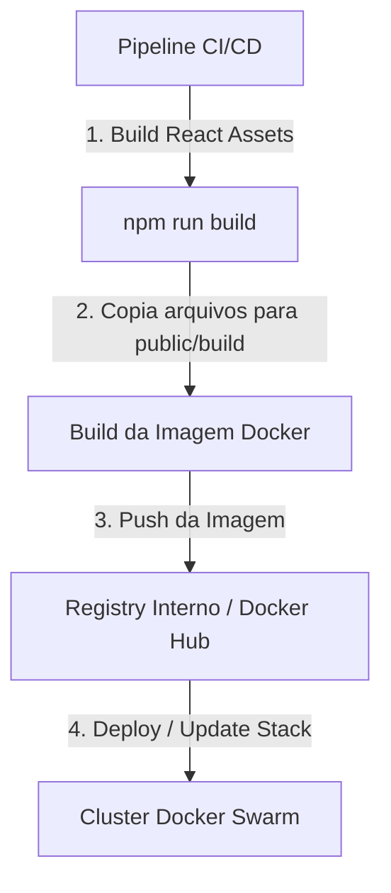

# Arquitetura desacoplada (BFF + SPA) & Estratégia de Deploy

Este documento detalha o funcionamento da arquitetura **Laravel BFF (Backend for Frontend)** integrada ao **React SPA (Single Page Application)** e descreve a estratégia recomendada de Deploy Automatizado (CI/CD).

---

## 1. Visão Geral da Arquitetura

A arquitetura baseia-se no princípio do **desacoplamento funcional**:

```text
  [ Cliente (Navegador) ] 
       │ 
       ▼ (Requisições HTTP/JSON + Session Cookies)
  [ Laravel BFF ] 
       │ 
       ├─► [ Servidor SIA-Auth ] (Validação de credenciais)
       ├─► [ Microsserviço A ] (Comunicação via rede privada + JWT)
       └─► [ Microsserviço B ]
```

### Papel do Frontend (React SPA)
- Gerenciamento de rotas do usuário final (via `react-router-dom`).
- Renderização da UI (componentes de UI no padrão **shadcn/ui**).
- Gestão de estado do cliente.

### Papel do Backend (Laravel BFF)
- **Stateful Gateway**: Mantém a sessão do usuário ativa e segura usando cookies tradicionais do Laravel.
- **Proxy Seguro**: Traduz as requisições do frontend para os microsserviços internos, gerenciando a obtenção e renovação de tokens JWT com o `Sia-Auth`.
- **Prevenção de Ataques**: Lida nativamente com proteção contra CSRF (Cross-Site Request Forgery).

---

## 2. Estrutura e Build do Frontend

O frontend é processado pelo **Vite**, que empacota o código React em assets estáticos otimizados (CSS e JS minificados).

No arquivo [package.json](file:///home/soares/projects/template-react/package.json), definimos as rotinas de build:
- `npm run dev`: Inicializa o servidor de desenvolvimento rápido (HMR - Hot Module Replacement).
- `npm run build`: Compila a aplicação para produção e gera os hashes dos arquivos no diretório `public/build/`.

### Integração Laravel-Vite
O Laravel 12 detecta os arquivos compilados através do arquivo `public/build/manifest.json`. O arquivo [app.blade.php](file:///home/soares/projects/template-react/resources/views/app.blade.php) utiliza a diretiva `@vite` para carregar a versão correta em produção automaticamente:

```html
@viteReactRefresh
@vite(['resources/js/app.jsx'])
```

## 3. Estratégia de Deploy Automatizado (Docker Swarm)

A estratégia de implantação deste projeto segue a filosofia de **artefato único via Docker** (Container auto-suficiente), rodando sob orquestração no **Docker Swarm**. Todo o código do Laravel (BFF) e os arquivos estáticos compilados do React (SPA) são empacotados na mesma imagem. **Não há uso de CDNs externas**.



### 3.1. Pipeline de CI/CD (Construção da Imagem)

Durante a esteira automatizada (ex: GitLab CI, GitHub Actions, Jenkins), o processo consiste em:
1. **Compilar o React**: Roda-se `npm install` e `npm run build` no ambiente de CI para gerar a pasta `/public/build/` com os assets finais minificados.
2. **Construir a Imagem do Container**: 
   A imagem Docker do BFF é construída incluindo:
   * O código fonte do Laravel.
   * As dependências do Composer (`composer install --no-dev`).
   * A pasta de assets compilados `/public/build/`.
3. **Publicação**: A imagem contendo toda a aplicação é publicada no Docker Registry corporativo com a tag da versão/commit.

### 3.2. Orquestração no Docker Swarm

O deploy no Docker Swarm utiliza o comando `docker stack deploy` fazendo referência ao arquivo de stack (geralmente `docker-compose.prod.yml`).

#### Vantagens no Docker Swarm:
- **Zero Downtime (Rolling Updates)**: O Swarm atualiza as réplicas do container de forma gradual (uma por uma). Como o container possui os scripts React embutidos localmente na imagem, não há risco de inconsistência de arquivos durante a rolagem da versão.
- **Armazenamento Local Autossuficiente**: Por não utilizar CDNs, o próprio servidor HTTP configurado na imagem (ex: Nginx ou PHP artisan serve rodando em alta disponibilidade) serve os scripts do React e o backend da mesma origem física.
- **Configurações Dinâmicas (Docker Secrets/Configs)**: Parâmetros do `.env` (ex: chaves de assinatura do `Sia-Auth`, chaves de criptografia e banco de dados) são injetados em tempo de execução de forma segura pelo Swarm.

---

## 4. Resiliência e Manutenabilidade

* **Sem Dependência Externa de CDN**: A infraestrutura depende apenas dos servidores do cluster Swarm, mantendo o tráfego e os dados da aplicação dentro da rede controlada.
* **Cache Inteligente**: O Vite gera hashes nos nomes dos arquivos de assets (ex: `app-D2QVtkhP.js`). Toda vez que uma nova imagem Docker entra em execução no Swarm, o manifest avisa o Laravel para buscar a nova hash, forçando o navegador a baixar a versão atualizada instantaneamente sem problemas de cache persistente.
