# Conexão Frontend (React SPA) e Backend (Laravel BFF)

Este documento descreve como é realizada a comunicação, a autenticação e a proteção contra ataques CSRF entre o cliente React (SPA) e o servidor Laravel (BFF).

---

## 1. Fluxo de Comunicação Base

Como a aplicação é uma Single Page Application (SPA) tradicional sem o acoplamento do Inertia.js, a comunicação ocorre inteiramente de forma assíncrona através de requisições HTTP (JSON/REST) utilizando **Axios** ou **Fetch API**.

```mermaid
sequenceDiagram
    participant React as React SPA (Porta 5173 / Servido pelo BFF)
    participant BFF as Laravel BFF (Porta 28432)
    participant SIA as Servidor SIA-Auth / APIs
    
    rect rgb(15, 23, 42)
        note right of React: 1. Proteção CSRF Inicial
        React->>BFF: GET /sanctum/csrf-cookie
        BFF-->>React: Set-Cookie: XSRF-TOKEN
    end
    
    rect rgb(30, 41, 59)
        note right of React: 2. Login Autenticado
        React->>BFF: POST /login (com e-mail/senha) + Header X-XSRF-Token
        BFF-->>React: Set-Cookie: laravel_session (HttpOnly) & 200 OK
    end

    rect rgb(15, 23, 42)
        note right of React: 3. Consumo de Dados Seguro
        React->>BFF: GET /api/dados-perfil (com Session Cookie)
        BFF->>SIA: GET /api/v1/recurso (Com JWT + Contexto do Usuário)
        SIA-->>BFF: Retorna Dados JSON
        BFF-->>React: Retorna Dados JSON
    end
```



---

## 2. Proteção CSRF (Cross-Site Request Forgery)

O Laravel possui proteção nativa contra CSRF para rotas do grupo `web`. Como o BFF utiliza autenticação baseada em sessão (cookies) com o React, cada requisição de escrita (`POST`, `PUT`, `PATCH`, `DELETE`) deve obrigatoriamente enviar o cabeçalho `X-XSRF-TOKEN`.

### Configuração do Axios (`resources/js/bootstrap.js`)
Para que o Axios envie os cookies e o token CSRF automaticamente em todas as chamadas, ele deve ser inicializado da seguinte maneira:

```javascript
import axios from 'axios';
window.axios = axios;

// Permite o envio de cookies de sessão nas chamadas assíncronas
window.axios.defaults.withCredentials = true;
window.axios.defaults.withXSRFToken = true;

window.axios.defaults.headers.common['X-Requested-With'] = 'XMLHttpRequest';
```

---

## 3. Autenticação por Sessão (Stateful)

O BFF utiliza o **Laravel Sanctum** configurado para autenticação SPA baseada em sessões (Stateful).

### Fluxo de Autenticação passo a passo:

1. **Obter Token CSRF**:
   Antes de renderizar o formulário de login, o React SPA faz uma chamada GET para inicializar a proteção de CSRF no navegador:
   ```javascript
   await axios.get('/sanctum/csrf-cookie');
   ```

2. **Enviar Credenciais**:
   O formulário envia o e-mail e a senha do usuário ao BFF:
   ```javascript
   await axios.post('/login', {
       email: 'dev@exemplo.com',
       password: 'senha'
   });
   ```
   * O Laravel BFF valida as credenciais (localmente ou via SSO).
   * Define o cookie `laravel_session` como `HttpOnly` (seguro contra leitura de JavaScript).

3. **Consumir Rotas Protegidas**:
   Qualquer rota envelopada com o middleware `auth:sanctum` ou `auth` no arquivo `routes/web.php` ou `routes/api.php` validará automaticamente o cookie do usuário enviado pelo navegador.

---

## 4. Comunicação BFF -> APIs Downstream

Uma vez que o usuário está autenticado, o BFF atua como intermediário para sistemas externos. Existem dois padrões de chamada: **síncrono** (sequencial) e **assíncrono/paralelo**.

---

### 4.1 Padrão Síncrono (chamadas dependentes)

Use quando a chamada 2 depende do resultado da chamada 1 (ex: buscar token de autenticação antes de chamar a API seguinte).

```php
// PASSO 1 — Chama o Sistema A para obter um token
$respostaA = Http::timeout(5)->get('https://api.sistema-a.exemplo.com/v1/dados', [
    'id' => $id,
]);

if ($respostaA->failed()) {
    return response()->json(['message' => 'Sistema A indisponível.'], 502);
}

$tokenDoSistemaA = $respostaA->json('token');

// PASSO 2 — Usa o token para chamar o Sistema B
$respostaB = Http::timeout(5)
    ->withToken($tokenDoSistemaA)   // Authorization: Bearer ...
    ->get('https://api.sistema-b.exemplo.com/v1/dados', ['id' => $id]);
```

> **Desvantagem**: cada chamada aguarda a anterior terminar. 3 APIs de 1s cada = ~3s de espera.

---

### 4.2 Padrão Assíncrono/Paralelo com `Http::pool` + `Cache::remember`

Use quando as chamadas são **independentes** entre si (ex: buscar frotas, efetivo e cautelas ao mesmo tempo). Todas as requisições saem simultaneamente.

```php
$dadosConsolidados = Cache::remember("dashboard.{$unidade}", 60, function () use ($unidade) {

    // Dispara TODAS as chamadas ao mesmo tempo
    $responses = Http::pool(fn ($pool) => [

        $pool->as('sistema_a')
            ->timeout(5)
            ->get('https://api.sistema-a.exemplo.com/v1/dados', ['unidade' => $unidade]),

        $pool->as('sistema_b')
            ->timeout(5)
            ->get('https://api.sistema-b.exemplo.com/v1/dados', ['unidade' => $unidade]),

        $pool->as('sistema_c')
            ->timeout(5)
            ->get('https://api.sistema-c.exemplo.com/v1/dados', ['unidade' => $unidade]),
    ]);

    // Monta o DTO com fallbacks: se um sistema falhou, usa valor padrão seguro
    return [
        'sistema_a' => $responses['sistema_a']->successful()
            ? ['total' => $responses['sistema_a']->json('total') ?? 0,
               'ativos' => $responses['sistema_a']->json('ativos') ?? 0]
            : ['total' => 0, 'ativos' => 0],

        'sistema_b' => $responses['sistema_b']->successful()
            ? ($responses['sistema_b']->json('itens') ?? [])
            : [],

        'sistema_c' => $responses['sistema_c']->successful()
            ? $responses['sistema_c']->json()
            : null,

        // meta.status informa o React quais sistemas estão online.
        // O React exibe badge "Indisponível" apenas no card afetado.
        'meta' => [
            'status' => [
                'sistema_a_online' => $responses['sistema_a']->successful(),
                'sistema_b_online' => $responses['sistema_b']->successful(),
                'sistema_c_online' => $responses['sistema_c']->successful(),
            ],
            'cache_gerado_em' => now()->toIso8601String(),
        ],
    ];
});

return response()->json($dadosConsolidados);
```

> **Vantagem**: 5 APIs de 1s cada em paralelo = ainda ~1s de espera total.

> **Cache**: `Cache::remember` garante que, se 100 usuários acessarem ao mesmo tempo, os sistemas externos são chamados apenas **1 vez** por janela de 60 segundos.

---

### 4.3 Invalidação de Cache (endpoint de atualização forçada)

Para forçar a atualização antes do TTL expirar (ex: botão "Atualizar dados" no React):

```
DELETE /api/exemplo/cache?unidade=BPM01
```

```php
$chaveCache = "dashboard.{$validated['unidade']}";
Cache::forget($chaveCache); // Remove a chave; próxima requisição buscará dados frescos

return response()->json(['message' => 'Cache limpo. Próxima requisição buscará dados atualizados.']);
```

---

### 4.4 Contrato de resposta (DTO)

O BFF **nunca** retorna o JSON bruto das APIs externas diretamente ao React. Sempre estruture o contrato esperado pelo frontend — assim, se a API externa mudar, apenas o controller precisa ser ajustado:

```php
// ✅ Correto — contrato explícito mapeado pelo BFF
return response()->json([
    'dados_a' => [
        'id'   => $dadosA['id']   ?? null,
        'nome' => $dadosA['nome'] ?? 'Desconhecido',
    ],
    'dados_b' => [
        'total' => $respostaB->json('total') ?? 0,
        'itens' => $respostaB->json('itens') ?? [],
    ],
    'meta' => [
        'sistema_a_online' => true,
        'sistema_b_online' => true,
    ],
]);
```
