# Conexão Frontend (React SPA) e Backend (Laravel BFF)

Este documento descreve como é realizada a comunicação, a autenticação e a proteção contra ataques CSRF entre o cliente React (SPA) e o servidor Laravel (BFF).

---

## 1. Fluxo de Comunicação Base

Como a aplicação é uma Single Page Application (SPA) tradicional sem o acoplamento do Inertia.js, a comunicação ocorre inteiramente de forma assíncrona através de requisições HTTP (JSON/REST) utilizando **Axios** ou **Fetch API**.

```mermaid
sequenceDiagram
    participant React as React SPA (Porta 5173 / Servido pelo BFF)
    participant BFF as Laravel BFF (Porta 28432)
    participant SIA as Servidor SIA-Auth / APIs
    
    rect rgb(15, 23, 42)
        note right of React: 1. Proteção CSRF Inicial
        React->>BFF: GET /sanctum/csrf-cookie
        BFF-->>React: Set-Cookie: XSRF-TOKEN
    end
    
    rect rgb(30, 41, 59)
        note right of React: 2. Login Autenticado
        React->>BFF: POST /login (com e-mail/senha) + Header X-XSRF-Token
        BFF-->>React: Set-Cookie: laravel_session (HttpOnly) & 200 OK
    end

    rect rgb(15, 23, 42)
        note right of React: 3. Consumo de Dados Seguro
        React->>BFF: GET /api/dados-perfil (com Session Cookie)
        BFF->>SIA: GET /api/v1/recurso (Com JWT + Contexto do Usuário)
        SIA-->>BFF: Retorna Dados JSON
        BFF-->>React: Retorna Dados JSON
    end
```



---

## 2. Proteção CSRF (Cross-Site Request Forgery)

O Laravel possui proteção nativa contra CSRF para rotas do grupo `web`. Como o BFF utiliza autenticação baseada em sessão (cookies) com o React, cada requisição de escrita (`POST`, `PUT`, `PATCH`, `DELETE`) deve obrigatoriamente enviar o cabeçalho `X-XSRF-TOKEN`.

### Configuração do Axios (`resources/js/bootstrap.js`)
Para que o Axios envie os cookies e o token CSRF automaticamente em todas as chamadas, ele deve ser inicializado da seguinte maneira:

```javascript
import axios from 'axios';
window.axios = axios;

// Permite o envio de cookies de sessão nas chamadas assíncronas
window.axios.defaults.withCredentials = true;
window.axios.defaults.withXSRFToken = true;

window.axios.defaults.headers.common['X-Requested-With'] = 'XMLHttpRequest';
```

---

## 3. Autenticação por Sessão (Stateful)

O BFF utiliza o **Laravel Sanctum** configurado para autenticação SPA baseada em sessões (Stateful).

### Fluxo de Autenticação passo a passo:

1. **Obter Token CSRF**:
   Antes de renderizar o formulário de login, o React SPA faz uma chamada GET para inicializar a proteção de CSRF no navegador:
   ```javascript
   await axios.get('/sanctum/csrf-cookie');
   ```

2. **Enviar Credenciais**:
   O formulário envia o e-mail e a senha do usuário ao BFF:
   ```javascript
   await axios.post('/login', {
       email: 'dev@exemplo.com',
       password: 'senha'
   });
   ```
   * O Laravel BFF valida as credenciais (localmente ou via SSO).
   * Define o cookie `laravel_session` como `HttpOnly` (seguro contra leitura de JavaScript).

3. **Consumir Rotas Protegidas**:
   Qualquer rota envelopada com o middleware `auth:sanctum` ou `auth` no arquivo `routes/web.php` ou `routes/api.php` validará automaticamente o cookie do usuário enviado pelo navegador.

---

## 4. Comunicação BFF -> APIs Downstream (SIA)

Uma vez que o usuário está autenticado no BFF:

1. O React solicita dados ao BFF (Ex: `GET /api/documentos`).
2. O BFF captura a requisição e busca na sessão do servidor o token JWT de microsserviços associado ao usuário.
3. Se o token não existir ou expirar, o BFF executa a função de renovação preventiva:
   ```php
   // Busca um novo token de microsserviço no Sia-Auth
   $tokenApi = SiaAPI::buscaToken();
   ```
4. O BFF injeta o token final e os dados de auditoria do usuário logado (`Session::get('user')`) na requisição final para as APIs downstream utilizando a Facade HTTP:
   ```php
   $resposta = Http::withHeaders([
       'Authorization' => 'Bearer ' . $tokenApi
   ])->post('http://api-servico/v1/documentos', [
       'token' => $tokenApi,
       'user_id' => session('user.id'),
       'rg' => session('user.rg'),
       // ... outros dados contextuais
   ]);
   ```
5. O BFF devolve os dados brutos ou tratados no formato JSON diretamente para o React SPA.
