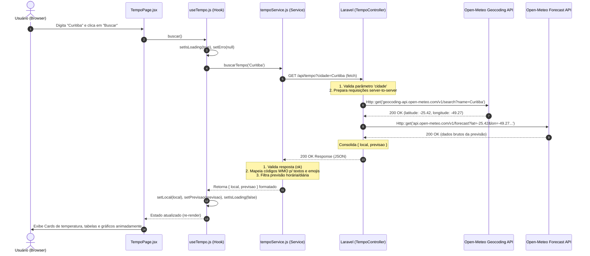

# Chamadas a APIs Externas — Padrão BFF de Módulo

Este documento descreve como implementar um módulo React que realiza **chamadas a APIs externas** seguindo a arquitetura **BFF (Backend for Frontend)** do projeto.

O **módulo Tempo** é usado como exemplo prático, utilizando a API pública [Open-Meteo](https://open-meteo.com/) (gratuita, sem necessidade de token).

> [!IMPORTANT]
> O React **nunca chama APIs externas diretamente**. Toda chamada a terceiros passa pelo Laravel (BFF), que atua como proxy seguro. O frontend sempre conversa com sua própria origem (`/api/*`).

---

## 1. Visão Geral da Arquitetura BFF

```text
┌─────────────────────────────────────────────────────────────────────────────────────────────┐
│ 1. NAVEGADOR (FRONTEND SPA - REACT)                                                         │
│    [Usuário Clica / Busca Cidade]                                                           │
│           │                                                                                 │
│           ▼                                                                                 │
│    [TempoPage.jsx]  ──(1. Renderiza UI)──►  [useTempo.js]  ──(2. Dispara Busca)──►  [tempoService.js]
│                                                                                       │     │
└───────────────────────────────────────────────────────────────────────────────────────┼─────┼─┘
                                                                                        │     │
   3. Requisição HTTP Assíncrona (AJAX / JSON)                                          │     │
   GET /api/tempo?cidade=Curitiba (com Cookies de Sessão Same-Origin)                     │     │
                                                                                        │     │
┌───────────────────────────────────────────────────────────────────────────────────────┼─────┼─┐
│ 2. SERVIDOR (BACKEND FOR FRONTEND - LARAVEL 12)                                       ▼     │
│    [routes/web.php] (Route::prefix('api'))                                                  │
│           │                                                                                 │
│           ▼                                                                                 │
│    [TempoController.php @ previsao]                                                         │
│           │ (Valida parâmetro 'cidade')                                                     │
│           ├─────────────────────────(4. Http::get Geocoding)────────────────┐            │
│           ├─────────────────────────(6. Http::get Forecast)─┐              │            │
│           ▼                                               │              │            │
└───────────┼───────────────────────────────────────────────┼──────────────┼────────────┼─┘
            │                                               │              │            │
            │  Requisições HTTP Externas (Server-to-Server) │              │            │
            │                                               ▼              ▼            │
┌───────────┼───────────────────────────────────────────────────────────────────────────┼─┐
│ 3. API EXTERNA DE TERCEIROS (OPEN-METEO)                                              │ │
│           │                                       [Geocoding API]    [Forecast API]   │ │
│           │                                              │                  │         │ │
│           │ (5. Retorna Coordenadas Lat/Lon)─────────────┴──────────────────┘         │ │
│           │ (7. Retorna Clima Bruto JSON)───────────────────────────────────┐         │ │
└───────────┼─────────────────────────────────────────────────────────────┼─────────┼─┘
            │                                                             │         │
   8. BFF formata a resposta consolidada { local, previsao }              │         │
   HTTP 200 OK (JSON) ◄────────────────────────────────────────────────────┘         │
            │                                                                       │
   9. Service JS recebe a resposta ◄─────────────────────────────────────────────────┘
      └─► transformaDados() (trata datas, ícones, WMO codes)
           └─► 10. Atualiza Estados no React Hook (setPrevisao, setIsLoading(false))
                └─► 11. Re-renderiza componentes da UI no React (Cards, Tabelas, Gráficos)
```

O React **nunca sabe** qual API externa está sendo consultada. Ele apenas faz `fetch('/api/tempo')` para o próprio servidor.

---

## 2. Fluxo de Dados Completo (Sequência de Execução)



---

## 3. Camada 1 — Rota Laravel (`routes/web.php`)

Todas as rotas de API do BFF são declaradas em `routes/web.php` sob o grupo de rotas com prefixo `/api/`.

```php
// routes/web.php

use App\Http\Controllers\Tempo\TempoController;

// Todas as rotas de API agrupadas sob o prefixo /api/
Route::prefix('api')->group(function () {

    // Status do BFF
    Route::get('/status', fn() => response()->json(['status' => 'online']));

    // Módulo Tempo — proxy para a Open-Meteo
    Route::get('/tempo', [TempoController::class, 'previsao']);

    // Adicione aqui os endpoints dos novos módulos:
    // Route::get('/efetivo',   [EfetivoController::class, 'index']);
    // Route::post('/relatorio',[RelatorioController::class, 'store']);

});

// Fallback: qualquer rota não mapeada acima carrega o React SPA
Route::fallback(fn() => view('app'));
```

> [!NOTE]
> Não existe `routes/api.php` neste projeto. Todas as rotas (web e API JSON) ficam em `routes/web.php`, pois o projeto usa sessões Laravel para autenticação em vez de tokens Sanctum stateless.

### Convenção de nomenclatura de rotas

| Tipo | Padrão | Exemplo |
|---|---|---|
| Rota principal do módulo | `GET /api/modulo` | `GET /api/tempo` |
| Rota de detalhe | `GET /api/modulo/{id}` | `GET /api/tempo/{cidade}` |
| Criação | `POST /api/modulo` | `POST /api/efetivo` |
| Atualização | `PUT /api/modulo/{id}` | `PUT /api/efetivo/{id}` |

---

## 4. Camada 2 — Controller Laravel (`app/Http/Controllers/Tempo/TempoController.php`)

Os controllers backend devem ser organizados em **subpastas por módulo** dentro de `app/Http/Controllers/` (ex: `Tempo/`, `Efetivo/`, `Frotas/`).

O controller é o **único ponto do sistema** que se comunica com a API externa.

```php
// app/Http/Controllers/Tempo/TempoController.php

namespace App\Http\Controllers\Tempo;

use App\Http\Controllers\Controller;
use Illuminate\Http\Request;
use Illuminate\Http\JsonResponse;
use Illuminate\Support\Facades\Http;

class TempoController extends Controller
{
    // URLs externas ficam aqui — invisíveis ao navegador
    private const GEO_URL  = 'https://geocoding-api.open-meteo.com/v1/search';
    private const BASE_URL = 'https://api.open-meteo.com/v1/forecast';

    /**
     * GET /api/tempo
     * Recebe: ?cidade=Curitiba
     * Retorna: JSON com { local, previsao }
     */
    public function previsao(Request $request): JsonResponse
    {
        // 1. Validação dos parâmetros de entrada
        $validated = $request->validate([
            'cidade' => ['required', 'string', 'min:2', 'max:100'],
        ]);

        // 2. Geocoding: resolve nome da cidade em coordenadas
        $geoResposta = Http::timeout(10)->get(self::GEO_URL, [
            'name'     => $validated['cidade'],
            'count'    => 1,
            'language' => 'pt',
        ]);

        if ($geoResposta->failed()) {
            return response()->json(['message' => 'Erro ao buscar localização.'], 502);
        }

        $geoData = $geoResposta->json();

        if (empty($geoData['results'])) {
            return response()->json(
                ['message' => "Cidade \"{$validated['cidade']}\" não encontrada."],
                404
            );
        }

        $local = $geoData['results'][0];

        // 3. Forecast: busca a previsão do tempo pelas coordenadas
        $forecastResposta = Http::timeout(10)->get(self::BASE_URL, [
            'latitude'  => $local['latitude'],
            'longitude' => $local['longitude'],
            'current'   => 'temperature_2m,relative_humidity_2m,...',
            'daily'     => 'weather_code,temperature_2m_max,...',
            'timezone'  => 'America/Sao_Paulo',
        ]);

        if ($forecastResposta->failed()) {
            return response()->json(['message' => 'Erro ao buscar previsão.'], 502);
        }

        // 4. Retorna JSON estruturado para o React
        return response()->json([
            'local' => [
                'nome'   => $local['name'],
                'estado' => $local['admin1'] ?? '',
                'pais'   => $local['country_code'] ?? '',
            ],
            'previsao' => $forecastResposta->json(),
        ]);
    }
}
```

### Padrão de retorno de erros HTTP

| Código | Quando usar |
|---|---|
| `200` | Sucesso com dados |
| `404` | Recurso não encontrado (ex: cidade inválida) |
| `422` | Validação falhou (o Laravel retorna automaticamente) |
| `502` | API externa respondeu com erro |

---

## 5. Camada 3 — Service JavaScript (`tempoService.js`)

O service chama **apenas o BFF**, nunca APIs externas diretamente.

```javascript
// resources/js/modules/Tempo/services/tempoService.js

/**
 * Busca a previsão do tempo via BFF.
 * Chama GET /api/tempo?cidade={cidade}
 */
export async function buscarTempo(cidade) {
    const params = new URLSearchParams({ cidade });

    // ✅ Chama o BFF (/api/tempo) — nunca a API externa diretamente
    const resposta = await fetch(`/api/tempo?${params}`, {
        method:      'GET',
        credentials: 'same-origin',       // inclui cookies de sessão
        headers: {
            'Accept':           'application/json',
            'X-Requested-With': 'XMLHttpRequest',
        },
    });

    const dados = await resposta.json();

    // Trata erros HTTP retornados pelo Laravel (404, 502, etc.)
    if (!resposta.ok) {
        throw new Error(dados.message ?? `Erro HTTP ${resposta.status}`);
    }

    return {
        local:    dados.local,
        previsao: transformarPrevisao(dados.previsao), // ← transforma antes de retornar
    };
}

// Funções privadas de transformação (não exportadas)
function transformarPrevisao(dados) { /* mapeia current, hourly, daily */ }
function descreverClima(codigo)     { /* WMO code → descrição em pt-BR */ }
function iconeClima(codigo)         { /* WMO code → emoji */              }
```

### Regras do Service

- ✅ Chame sempre `/api/seu-endpoint` (BFF), nunca URLs externas.
- ✅ Use `credentials: 'same-origin'` para incluir cookies de sessão.
- ✅ Transforme o JSON bruto em estrutura limpa antes de retornar.
- ✅ Lance `Error` com mensagem legível — o hook captura e exibe ao usuário.
- ❌ Nunca importe `useState`, `useEffect` ou componentes React aqui.

---

## 6. Camada 4 — Hook React (`useTempo.js`)

O hook é a cola entre o service e a UI. Gerencia todos os estados.

```javascript
// resources/js/modules/Tempo/hooks/useTempo.js

import { useState, useCallback } from 'react';
import { buscarTempo } from '../services/tempoService';

export function useTempo() {
    const [cidade,    setCidade]   = useState('Curitiba');
    const [local,     setLocal]    = useState(null);    // localização do BFF
    const [previsao,  setPrevisao] = useState(null);    // dados da previsão
    const [isLoading, setIsLoading]= useState(false);
    const [erro,      setErro]     = useState(null);

    const buscar = useCallback(async () => {
        if (!cidade.trim()) return;

        setIsLoading(true);
        setErro(null);
        setPrevisao(null);
        setLocal(null);

        try {
            // Uma única chamada ao service — BFF resolve tudo
            const resultado = await buscarTempo(cidade.trim());
            setLocal(resultado.local);
            setPrevisao(resultado.previsao);
        } catch (e) {
            setErro(e.message ?? 'Erro inesperado.');
        } finally {
            setIsLoading(false); // sempre executado, mesmo em caso de erro
        }
    }, [cidade]);

    return { cidade, setCidade, local, previsao, isLoading, erro, buscar };
}
```

### Por que `useCallback`?

A função `buscar` fica estável entre re-renders, evitando loops infinitos quando usada como dependência de `useEffect`.

---

## 7. Camada 5 — Menu (`TempoMenu.jsx`)

Segue o padrão `*Menu.jsx` de todos os módulos:

```jsx
// resources/js/modules/Tempo/components/TempoMenu.jsx

import ModuleHeader from '@/components/ModuleHeader';
import ActionButton from '@/components/ui/action-button';
import { CloudSun, RefreshCw } from 'lucide-react';

export default function TempoMenu({ onAtualizar, isLoading }) {
    const navItems = [
        { to: '/tempo', label: 'Previsão do Tempo', end: true },
    ];

    return (
        <ModuleHeader
            title="Previsão do Tempo"
            description="Consulta via API pública Open-Meteo (sem token)."
            icon={CloudSun}
            badge="Open-Meteo"
            navItems={navItems}
        >
            {onAtualizar && (
                <ActionButton
                    icon={RefreshCw}
                    label={isLoading ? 'Buscando...' : 'Atualizar'}
                    variant="outline"
                    disabled={isLoading}
                    onClick={onAtualizar}
                    responsive
                    className={isLoading ? '[&_svg]:animate-spin' : ''}
                />
            )}
        </ModuleHeader>
    );
}
```

---

## 8. Camada 6 — Página (`TempoPage.jsx`)

A página é responsável **apenas pela renderização**. Toda lógica vem do hook.

```jsx
// resources/js/modules/Tempo/pages/TempoPage.jsx

export default function TempoPage() {
    // ── Consome o hook — toda lógica encapsulada aqui ─────────────────────────
    const { cidade, setCidade, local, previsao, isLoading, erro, buscar } = useTempo();

    // ── Busca automática ao montar o componente ───────────────────────────────
    useEffect(() => { buscar(); }, []);

    // ── 3 estados de renderização (mutuamente exclusivos) ─────────────────────

    if (isLoading) return <Layout><Skeleton /></Layout>;  // 1. Carregando

    return (
        <Layout>
            <TempoMenu onAtualizar={buscar} isLoading={isLoading} />

            {erro     && <CardErro mensagem={erro} />}   // 2. Erro
            {previsao && <ConteudoPrevisao />}            // 3. Dados
        </Layout>
    );
}
```

### Padrão de exibição condicional

| Condição | Renderiza |
|---|---|
| `isLoading === true` | `<Skeleton />` animados (retorno antecipado) |
| `erro !== null` | Card de erro com a mensagem vinda do BFF |
| `previsao !== null` | Cards de métricas, previsão horária e semanal |

---

## 9. Registro da Rota React (`app.jsx`)

```javascript
// resources/js/app.jsx

import TempoPage from './modules/Tempo/pages/TempoPage';

// Dentro do <Routes>:
<Route path="/tempo" element={<TempoPage />} />
```

---

## 10. Estrutura Final do Módulo Tempo

```text
routes/
└── web.php                              ← GET /api/tempo → TempoController@previsao

app/Http/Controllers/
└── Tempo/
    └── TempoController.php              ← Valida + chama Open-Meteo via Http:: + retorna JSON

resources/js/modules/Tempo/
├── services/
│   └── tempoService.js                  ← fetch('/api/tempo') + transformação de dados
├── hooks/
│   └── useTempo.js                      ← useState + useCallback + orquestração
├── components/
│   └── TempoMenu.jsx                    ← ModuleHeader com navItems e botão Atualizar
└── pages/
    └── TempoPage.jsx                    ← UI pura: Skeleton / Erro / Dados
```

---

## 11. Como replicar este padrão em outro módulo

- [ ] **Backend — Rota**: Declarar `Route::get('/tempo', [TempoController::class, 'metodo'])` dentro de `Route::prefix('api')->group(...)` em `routes/web.php`
- [ ] **Backend — Controller**: Criar `app/Http/Controllers/NomeModulo/NomeModuloController.php`
  - Usar namespace `App\Http\Controllers\NomeModulo;`
  - Usar `$request->validate([...])` para validar entrada
  - Usar `Http::timeout(10)->get(URL_EXTERNA, [...])` para chamar APIs de terceiros
  - Verificar `->failed()` e retornar `response()->json(['message' => '...'], 502)`
  - Retornar `response()->json([...])` com dados estruturados
- [ ] **Frontend — Service**: Criar `modules/SeuModulo/services/seuModuloService.js`
  - `fetch('/api/modulo', { credentials: 'same-origin', headers: {...} })`
  - Verificar `resposta.ok`, lançar `Error` com `dados.message`
  - Transformar o JSON bruto antes de retornar
- [ ] **Frontend — Hook**: Criar `modules/SeuModulo/hooks/useSeuModulo.js`
  - Declarar `dados`, `isLoading`, `erro` com `useState`
  - Envolver a função de busca em `useCallback`
  - Usar `try/catch/finally` garantindo `setIsLoading(false)`
- [ ] **Frontend — Menu**: Criar `modules/SeuModulo/components/SeuModuloMenu.jsx` com `ModuleHeader`
- [ ] **Frontend — Página**: Criar `modules/SeuModulo/pages/SeuModuloPage.jsx`
  - Consumir apenas o hook (sem `fetch` direto, sem `useState` de negócio)
  - Implementar os 3 estados: Skeleton / Erro / Dados
- [ ] **Rota React**: Importar a página e declarar `<Route path="/modulo" />` em `app.jsx`

---

## 12. Arquivos de referência

| Arquivo | Camada | Link |
|---|---|---|
| `web.php` | Rota Laravel | [web.php](file:///home/soares/projects/template-react/routes/web.php) |
| `TempoController.php` | Controller BFF | [TempoController.php](file:///home/soares/projects/template-react/app/Http/Controllers/Tempo/TempoController.php) |
| `tempoService.js` | Service JS | [tempoService.js](file:///home/soares/projects/template-react/resources/js/modules/Tempo/services/tempoService.js) |
| `useTempo.js` | Hook | [useTempo.js](file:///home/soares/projects/template-react/resources/js/modules/Tempo/hooks/useTempo.js) |
| `TempoMenu.jsx` | Menu | [TempoMenu.jsx](file:///home/soares/projects/template-react/resources/js/modules/Tempo/components/TempoMenu.jsx) |
| `TempoPage.jsx` | Página | [TempoPage.jsx](file:///home/soares/projects/template-react/resources/js/modules/Tempo/pages/TempoPage.jsx) |
| `app.jsx` | Rotas React | [app.jsx](file:///home/soares/projects/template-react/resources/js/app.jsx) |
